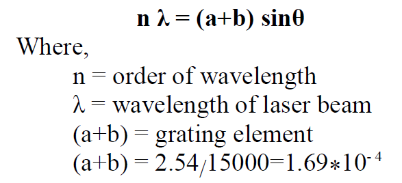

1. Switch on the electric power supply which is given to He-Ne Laser Apparatus.  

2. Observe the diffraction pattern on the Screen.  

3. Measure the distance between grating & the Screen (D).  

4. For the 1st order spectrum, measure the distance y1 & y2.  

5. Similarly, for 2nd order spectrum also measure y1 & y2.  

6. From the available data, compute wavelength (λ) for the given He-Ne Laser light.   

<h3> Observation Table </h3>

<table style="border: 1px solid #000">
<thead>
<tr style="border: 1px solid #000">
<th style="border: 1px solid #000">Sr. No.</th>
<th style="border: 1px solid #000">Order of spectrum(n)</th>
<th style="border: 1px solid #000">Dist. between Grating & screen in cm(D)</th>
<th style="border: 1px solid #000">Left (y1) cm</th>
<th style="border: 1px solid #000">Right (y2) cm</th>
<th style="border: 1px solid #000">Mean Y = (y1+y2)/2</th>
<th style="border: 1px solid #000">θ = tan&#8315;&#185; (Y/D)</th>
<th style="border: 1px solid #000">sin θ</th>
<th style="border: 1px solid #000">λ = {(a+b) sinθ}/n</th>
</tr>
</thead>
<tbody>
<tr>
<td style="border: 1px solid #000">1.</td>
<td style="border: 1px solid #000"></td>
<td style="border: 1px solid #000"></td>
<td style="border: 1px solid #000"></td>
<td style="border: 1px solid #000"></td>
<td style="border: 1px solid #000"></td>
<td style="border: 1px solid #000"></td>
<td style="border: 1px solid #000"></td>
<td style="border: 1px solid #000"></td>
</tr>
<tr>
<td style="border: 1px solid #000">2.</td>
<td style="border: 1px solid #000"></td>
<td style="border: 1px solid #000"></td>
<td style="border: 1px solid #000"></td>
<td style="border: 1px solid #000"></td>
<td style="border: 1px solid #000"></td>
<td style="border: 1px solid #000"></td>
<td style="border: 1px solid #000"></td>
<td style="border: 1px solid #000"></td>
</tr>
</tbody>
</table>

<h3>Formula</h3>

<h3> Result </h3>
1. Wavelength (λ) of a given light is   _____Å  
2. Standard value of Wavelength (λ) of a given light is   _____Å  
3. Percent Error in obtained result    _____%
