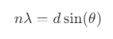
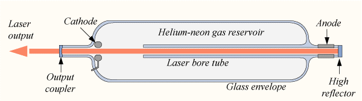
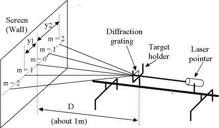

## Apparatus

He-Ne Laser apparatus, Grating, Scale.

## Theory

A diffraction grating consists of a large number of equally spaced, parallel slits or rulings. When light passes through a diffraction grating, it undergoes diffraction and produces a characteristic pattern of bright and dark fringes. The theory of diffraction grating is based on the principles of wave interference and diffraction.

When light, which is an electromagnetic wave, encounters a diffraction grating, it interacts with the individual slits or rulings in the grating. This interaction results in the phenomenon of wave interference. Interference occurs when waves from different slits overlap and combine. Diffraction is the bending of light waves as they encounter an obstacle or aperture. In the case of a diffraction grating, the slits or rulings act as multiple apertures through which light waves pass. As the waves pass through these apertures, they diffract and spread out.

The grating equation relates the angle of diffraction, the grating spacing, the wavelength of light, and the order of diffraction. This fundamental equation describes the behavior of a diffraction grating is known as the grating equation:

where,
&emsp;&emsp; n is the order of the diffraction (integer, typically starting from 0 for the central maximum),

&emsp;&emsp; λ is the wavelength of light,

&emsp;&emsp; d is the spacing between adjacent slits or rulings in the grating, known as the "grating spacing, grating element or grating constant",

&emsp;&emsp; θ is the angle of diffraction, which is the angle between the incident light direction and the direction of the diffracted light.

Diffraction gratings causes the spectral dispersion dispersing light into its constituent colors or wavelengths. This dispersion occurs because different wavelengths of light are diffracted at different angles according to the grating equation. This property is used in spectroscopy to analyze the spectral composition of light. Diffraction gratings are widely used in spectrometers and monochromators because they can provide high spectral resolution. Resolution is the ability to distinguish closely spaced wavelengths. It depends on factors such as the number of rulings in the grating and the order of diffraction.

## Diagram

 Fig.1. He-Ne Laser 

Fig.2. Diffraction Pattern
