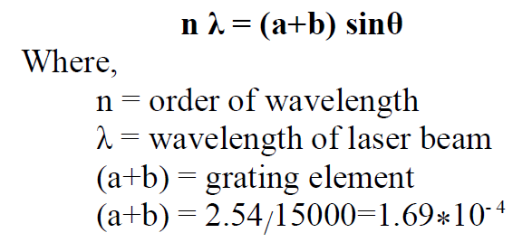

## Procedure

1. Switch on the electric power supply which is given to He-Ne Laser Apparatus.

2. Observe the diffraction pattern on the Screen.

3. Measure the distance between grating & the Screen (D).

4. For the 1st order spectrum, measure the distance y1 & y2.

5. Similarly, for 2nd order spectrum also measure y1 & y2.

6. From the available data, compute wavelength (λ) for the given He-Ne Laser light.

## Observation Table

| Sr. No. | Order of spectrum(n) | Dist. between Grating & screen in cm(D) | Left (y1) cm | Right (y2) cm | Mean Y = (y1+y2)/2 | θ = tan&#8315;&#185; (Y/D) | sin θ | λ = {(a+b) sinθ}/n |
| ------- | -------------------- | --------------------------------------- | ----------- | ------------- | ----------------- | --------------- | ----- | ---------------- |
| 1       |                      |                                         |             |               |                   |                 |       |                  |
| 2       |                      |                                         |             |               |                   |                 |       |                  |

## Formula

## Result
1. Wavelength (λ) of a given light is   _____Å
2. Standard value of Wavelength (λ) of a given light is   _____Å
3. Percent Error in obtained result    _____%
